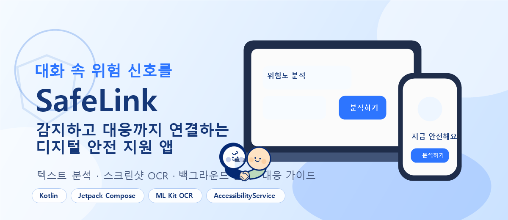

<h1 align="center">SafeLink</h1>

<p align="center">
  <strong>대화 속 위험 신호를 감지하고 대응까지 연결하는 Android 기반 디지털 안전 지원 앱</strong>
</p>

<p align="center">
  
  
  
  
</p>

SafeLink는 보이스피싱, 가족 사칭, 로맨스스캠, 투자 사기, 관계 통제·가스라이팅처럼 대화 안에서 시작되는 위험 상황을 사용자가 더 빠르게 인지하도록 돕는 것을 목표로 합니다. 단순히 “위험합니다”라고 알려주는 데서 끝나지 않고, 분석 결과와 근거를 보여준 뒤 실제 대응 방법까지 이어주는 구조로 설계했습니다.

```text
위험 대화 발생 → 기기 내 1차 규칙 기반 분석 → 위험도 결과 + 분석 근거 표시 → 대응 가이드 + 관련 기관 연결
```

## 바로 보기

- [프로젝트 개요](#프로젝트-개요)
- [핵심 기능](#핵심-기능)
- [주요 시연 흐름](#주요-시연-흐름)
- [앱 구조](#앱-구조)
- [위험도 분석 로직](#위험도-분석-로직)
- [기술 스택](#기술-스택)
- [폴더 구조](#폴더-구조)
- [실행 방법](#실행-방법)
- [현재 구현 상태](#현재-구현-상태)

---

## 프로젝트 개요

최근 디지털 범죄는 단순한 스팸 문자가 아니라 실제 대화처럼 위장된 형태로 발전하고 있습니다. 가족이나 지인을 사칭해 송금을 요구하거나, 링크 설치와 인증번호 입력을 유도하거나, 관계를 이용해 금전 요구와 심리적 압박을 반복하는 방식이 대표적입니다.

SafeLink는 이런 문제를 해결하기 위해 두 가지 방향에 집중했습니다.

1. 사용자가 대화 속 위험 신호를 너무 늦게 알아차리는 문제를 줄입니다.
2. 위험을 감지한 뒤 사용자가 무엇을 해야 하는지 바로 확인할 수 있게 합니다.

SafeLink의 핵심 판단은 AI가 아니라 앱 내부의 1차 규칙 기반 분석이 담당합니다. AI 보조분석은 필요한 경우에만 문맥 설명을 보완하는 역할로 사용합니다.

---

## 핵심 기능

| 기능 | 설명 | 상태 |
|---|---|---|
| 텍스트 위험도 분석 | 사용자가 직접 입력한 대화를 분석해 위험도를 판단합니다. | 구현 |
| 스크린샷 OCR 분석 | 대화 스크린샷에서 한국어 텍스트를 추출해 같은 분석 흐름으로 연결합니다. | 구현 |
| 백그라운드 감지 | 접근성 권한을 기반으로 다른 앱 화면의 위험 표현을 감지하고 알림을 제공합니다. | 구현 |
| 분석 근거 표시 | 키워드, 문장 규칙, 상황 규칙, AI 보조분석 근거를 결과 화면에 표시합니다. | 구현 |
| 대응 가이드 | 위험도에 따라 사용자가 취해야 할 행동을 안내합니다. | 구현 |
| 기관 연결 | 위험 유형에 맞는 관련 기관 정보를 제공합니다. | 구현 |
| 기록 저장 | 분석 기록과 자가진단 기록을 Room DB로 로컬 저장합니다. | 구현 |

---

## 주요 시연 흐름

### 1. 직접 입력 분석

```text
홈
  → 텍스트 입력
  → 위험도 분석
  → 결과 화면
  → 대응 가이드
  → 기관 정보 확인
```

가장 안정적인 메인 시연 흐름입니다. 사용자가 직접 입력한 대화가 분석되고, 위험도와 근거, 대응 방법까지 이어지는 전체 구조를 보여줄 수 있습니다.

### 2. 스크린샷 분석

```text
홈
  → 스크린샷 선택
  → ML Kit OCR
  → 위험도 분석
  → 결과 화면
  → 대응 가이드
```

실제 대화 캡처 이미지를 분석에 활용하는 기능입니다. OCR로 추출한 텍스트가 기존 분석 엔진으로 이어지는 구조를 보여줍니다.

### 3. 백그라운드 감지

```text
다른 앱 화면
  → AccessibilityService 기반 텍스트 감지
  → 기기 내 위험도 분석
  → 알림 표시
  → 대응 가이드 연결
```

SafeLink의 핵심 기능 확장 흐름입니다. 사용자가 앱을 직접 열지 않아도 위험 표현을 감지하고 대응 화면으로 연결되는 구조를 보여줍니다.

---

## 앱 구조

```text
사용자 입력
  ├─ 직접 텍스트 입력
  ├─ 스크린샷 OCR 입력
  └─ 백그라운드 접근성 입력
        ↓
DetectionViewModel
        ↓
DetectionRepository
        ↓
DetectionEngine
  ├─ 키워드 / 정규식 탐지
  ├─ 조합 규칙 점수화
  ├─ 문장 규칙 점수화
  ├─ 상황 규칙 점수화
  └─ 필요 시 AI 보조분석
        ↓
DetectionResult
        ↓
결과 화면
        ↓
대응 가이드
        ↓
기관 정보 연결
        ↓
Room DB 기록 저장
```

### 설계 방향

- 핵심 위험 판단은 기기 내부에서 수행합니다.
- OCR은 Google ML Kit 기반 온디바이스 텍스트 인식을 사용합니다.
- 백그라운드 감지는 사용자가 명시적으로 접근성 권한을 허용해야 동작합니다.
- AI는 핵심 판단기가 아니라 보조 설명 역할로 사용합니다.
- AI API 호출이 실패해도 기기 내 분석 결과는 유지됩니다.
- 전화번호, URL 같은 민감 정보는 API 사용 전 마스킹하는 구조를 사용합니다.

---

## 위험도 분석 로직

SafeLink는 단순 키워드 탐지 앱처럼 보이지 않도록 여러 규칙을 함께 반영합니다.

```text
입력 텍스트
  → 키워드 / 정규식 탐지
  → 기본 점수 계산
  → 조합 규칙 보정
  → 문장 규칙 점수화
  → 상황 규칙 점수화
  → 위험도 분류
  → 분석 근거 생성
  → 필요 시 AI 보조 설명
```

### 위험도 단계

| 단계 | 의미 |
|---|---|
| `SAFE` | 즉시 확인이 필요한 위험 신호가 뚜렷하지 않은 상태 |
| `CAUTION` | 일부 의심 표현이 있어 주의가 필요한 상태 |
| `WARNING` | 여러 위험 신호가 함께 감지된 상태 |
| `CRITICAL` | 즉시 확인과 대응이 권장되는 상태 |

### 반영된 규칙 예시

- 기관 사칭 + 개인정보 요구
- 긴급성 표현 + 송금 요구
- 링크 또는 앱 설치 + 본인 확인 유도
- 비밀 유지 요구 + 금전 요구
- 가족 사칭 + 새 번호 + 송금 요구
- 로맨스스캠 신뢰 형성 + 긴급 금전 요구
- 투자 수익 보장 + 입금 유도
- 폭로 협박 + 금전 요구
- 기억 부정과 책임 전가를 이용한 가스라이팅
- 관계 고립과 통제 유도

---

## 기술 스택

| 영역 | 기술 |
|---|---|
| 언어 | Kotlin |
| UI | Jetpack Compose, Material3 |
| 화면 이동 | Navigation Compose |
| 상태 관리 | ViewModel, Compose State |
| 의존성 주입 | Hilt |
| 로컬 DB | Room |
| OCR | Google ML Kit Korean Text Recognition |
| 네트워크 | Retrofit, OkHttp, Gson |
| 비동기 처리 | Kotlin Coroutines, Flow |
| 백그라운드 감지 | Android AccessibilityService |
| 알림 | NotificationChannel, NotificationCompat |
| 빌드 | Gradle Kotlin DSL, KSP |
| 백엔드 시연 | FastAPI 목 분석 서버 |

---

## 폴더 구조

```text
safelink/
├── android/                         # Android 앱
│   └── app/src/main/
│       ├── assets/                  # 키워드, 기관 데이터
│       ├── java/com/safelink/app/
│       │   ├── background/          # AccessibilityService 기반 감지
│       │   ├── data/
│       │   │   ├── local/           # Room DB Entity, DAO
│       │   │   ├── model/           # 위험도 및 분석 결과 모델
│       │   │   ├── ocr/             # ML Kit OCR 서비스
│       │   │   ├── remote/          # AI 보조분석 API DTO, Service
│       │   │   └── repository/      # 분석 및 기록 Repository
│       │   ├── notification/        # 위험 알림 처리
│       │   ├── security/            # 앱 잠금 관리
│       │   ├── settings/            # 기능 토글, 긴급 연락처 저장
│       │   └── ui/                  # Compose 화면 및 공통 컴포넌트
│       └── res/                     # 앱 리소스와 런처 이미지
├── backend/                         # API 연동 시연용 목 서버
├── data/                            # API 및 데이터 기준 파일
├── docs/                            # 요구사항, 설계, 흐름 문서
└── GitHub_레포_정리_기준.md          # GitHub 포트폴리오 정리 기준
```

---

## 실행 방법

### Android 앱

1. Android Studio에서 `android/` 폴더를 엽니다.
2. Gradle Sync를 실행합니다.
3. `app` 실행 구성을 선택합니다.
4. 에뮬레이터 또는 실제 Android 기기에서 실행합니다.

### 백엔드 목 서버

```bash
cd backend
pip install -r requirements.txt
uvicorn main:app --reload
```

Android 에뮬레이터에서 로컬 서버에 접근할 때는 `10.0.2.2` 주소를 사용합니다.

---

## 현재 구현 상태

- 텍스트 입력 분석 흐름 구현
- 스크린샷 OCR 분석 흐름 구현
- 백그라운드 감지 및 알림 흐름 구현
- 키워드, 문장 규칙, 상황 규칙, AI 보조분석 근거 표시 구현
- 대응 가이드 및 기관 연결 흐름 구현
- Room DB 기반 로컬 기록 저장 구현
- AI 보조분석 API 구조와 실패 시 fallback 구조 구현

---

## 공학경진대회 핵심 포인트

SafeLink는 단순 키워드 검사기가 아니라, 위험 대화 탐지부터 실제 대응까지 이어지는 디지털 안전 지원 앱입니다.

- 기기 내 1차 규칙 기반 판단
- 문장 규칙과 상황 규칙 기반 분석 근거
- 스크린샷 OCR 분석
- 백그라운드 위험 감지
- 대응 가이드와 기관 연결
- AI 보조분석을 통한 문맥 설명 보완

이 구조를 통해 기술 구현성과 실제 사용자 문제 해결 가능성을 함께 보여주는 것을 목표로 합니다.
