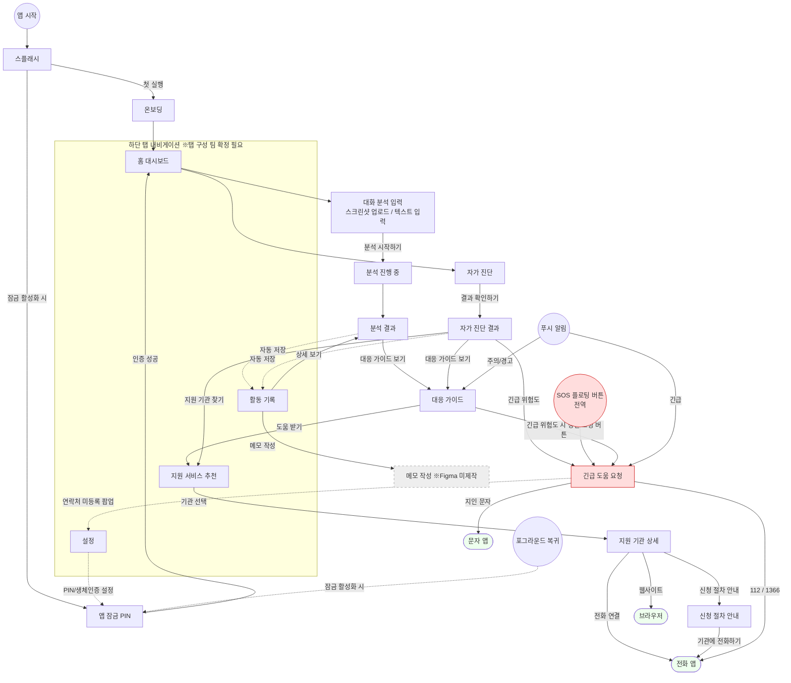

# SafeLink 화면 흐름도 (Screen Flow)

> 작성: 김재겸 | 기준: Design.md 4장 화면 구조 + Figma 와이어프레임 17개 화면 (2026-07-11)
>
> Figma: https://www.figma.com/design/pgz34E5ealhQwQICH9xSTy/safelink

---

## 1. 전체 화면 흐름도



---

## 2. 핵심 사용자 여정 (User Journey) 3가지

### 여정 A — 의심 대화 분석 (핵심 데모 흐름)
```
홈 → 대화 분석 입력(스크린샷/텍스트) → 분석 진행 중 → 분석 결과
→ 대응 가이드 → 지원 서비스 추천 → 지원 기관 상세 → 전화 연결/신청 절차 안내
```

### 여정 B — 자가진단
```
홈 → 자가 진단(체크리스트) → 자가 진단 결과
→ (주의/경고) 대응 가이드 → 지원 서비스 추천
→ (긴급) 긴급 도움 요청 → 112/1366 전화
```

### 여정 C — 긴급 상황
```
어느 화면이든 → SOS 버튼 → 긴급 도움 요청 → 112/1366 전화 or 지인 문자
(긴급 연락처 미등록 시 → 설정 이동 팝업)
```

---

## 3. 화면 ↔ Figma 매핑표

| # | 화면 ID (Design.md) | Figma 프레임 | 노드 ID | 상태 |
|---|---|---|---|---|
| 1 | — | 스플래시 화면 | 1:6084 | ✅ |
| 2 | — | 온보딩 | 20:443 | ✅ |
| 3 | `LockScreen` | 앱 잠금 (PIN 입력) | 20:1181 | ✅ |
| 4 | `HomeScreen` | 홈 대시보드 | 20:494 | ✅ |
| 5 | `DiagnosisScreen` | 자가 진단 | 20:846 | ✅ |
| 6 | `DiagnosisResultScreen` | 자가 진단 결과 (경고) | 20:922 | ✅ |
| 7 | `DetectionInputScreen` | 대화 분석 (텍스트 입력) | 20:691 | ✅ |
| 7-1 | `DetectionInputScreen` | 대화 분석 (스크린샷 업로드) | 20:762 | ✅ |
| 8 | — | 분석 진행 중 | 20:2 | ✅ |
| 9 | `DetectionResultScreen` | 분석 결과 | 20:117 | ✅ |
| 10 | `ResponseGuideScreen` | 대응 가이드 | 20:605 | ✅ |
| 11 | `SupportMatchScreen` | 지원 서비스 추천 | 20:318 | ✅ |
| 12 | `SupportDetailScreen` | 지원 기관 상세 정보 | 20:1236 | ✅ |
| 13 | `ApplicationGuideScreen` | 신청 절차 안내 | 20:1332 | ✅ |
| 14 | `EmergencyScreen` | 긴급 도움 요청 | 20:987 | ✅ |
| 15 | `RecordListScreen` | 활동 기록 | 20:213 | ✅ |
| 16 | `MemoEditScreen` | — | — | ❌ 미제작 |
| 17 | `SettingsScreen` | 설정 | 20:1061 | ✅ |

---

## 4. 팀 확정 필요 사항 (Open Questions)

| # | 항목 | 선택지 | 영향 |
|---|---|---|---|
| 1 | **하단 탭 구성** | ✅ **4탭(홈/기록/지원/설정)으로 결정 (7/13)** | 알림 이력은 활동 기록으로 흡수. 보안상(가해자 열람 위험) 알림 센터 화면 미채택. Figma를 4탭으로 수정 필요 |
| 2 | **대화 감지 입력 방식** | Tasks.md: 텍스트+클립보드 vs 노션: 스크린샷+OCR | Figma는 둘 다 제작됨. 1차 구현 범위 확정 필요 (OCR은 서버 작업 추가됨) |
| 3 | **기록 상세 화면** | 활동 기록의 "상세 보기" → 분석 결과 화면 재사용 여부 | 재사용 권장 (별도 화면 불필요) |
| 4 | **메모 작성 화면** | Figma 미제작 | Stitch 프롬프트 ⑨로 생성 예정 |

---

## 5. 화면별 진입점 정리

| 화면 | 진입 경로 |
|---|---|
| 홈 대시보드 | 앱 시작(잠금 해제 후), 하단 탭 |
| 대화 분석 입력 | 홈 "스크린샷 분석" 버튼 |
| 자가 진단 | 홈 "자가 진단" 버튼 |
| 대응 가이드 | 분석 결과, 자가 진단 결과, 주의/경고 알림 탭 |
| 지원 서비스 추천 | 하단 탭(지원), 대응 가이드 "도움 받기", 자가 진단 결과 |
| 긴급 도움 요청 | SOS 플로팅 버튼(전역), 긴급 알림 탭, 자가 진단 결과(긴급), 대응 가이드(긴급) |
| 활동 기록 | 하단 탭(기록), 분석/진단 완료 시 자동 저장 |
| 설정 | 하단 탭(설정), 긴급 연락처 미등록 팝업 |
| 앱 잠금 | 앱 시작, 포그라운드 복귀 (잠금 활성화 시) |
